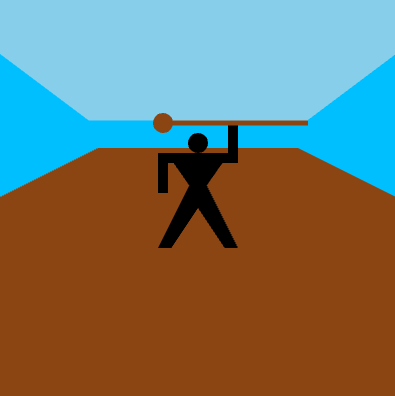
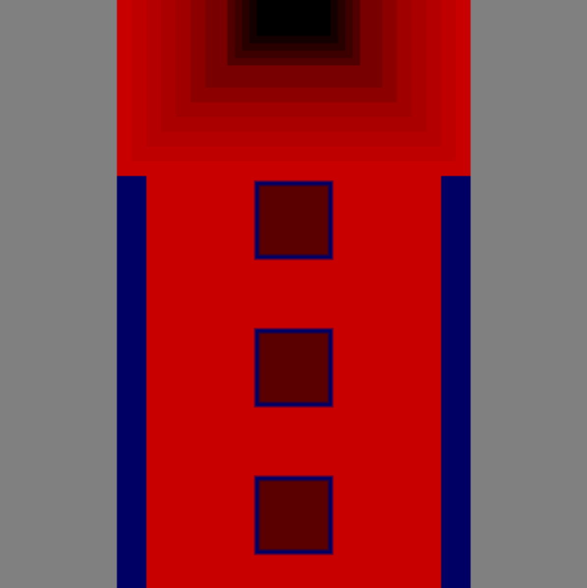

# CART 253: Creative Computation

this will be my CART 253 project showcase website!Hope you like it!!!! (Odyssy is not my favorite movie. It's just the first thing that came to mind having watched it so recently.)

## Useful Links

- [Reflective Journal](journal.md)
- [My GitHub profile](https://github.com/Sishooboy)

## Prototyping: Instructions

### Robot

- [Run the prototype](https://sishooboy.github.io/CART-253-/instructions-prototypes/robot/)
- [View the code](instructions-prototypes/robot/sketch.js)

### Moses and the Sea

- [Run the prototype](https://sishooboy.github.io/CART-253-/instructions-prototypes/moses-sea/)
- [View the code](instructions-prototypes/moses-sea/sketch.js)

### Abstract Squares

- [Run the prototype](https://sishooboy.github.io/CART-253-/instructions-prototypes/abstractsquares/)
- [View the code](instructions-prototypes/abstractsquares/sketch.js)
